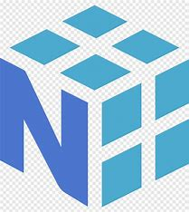

  <h1 align="center">Hi, I'm Ashita 👋</h1>
  <h4 align="center">Passionate about Solving Real-World Problems through Innovation</h4>

### 🚀 About Me
- 🎓 Second-year engineering student (BTech in AI & ML) 
- 🤖 Passionate about Artificial Intelligence, Machine Learning, and Data Science
- 🔥 Also exploring Backend Development, Python (NumPy, Pandas, Matplotlib), Robotics, Automotive Design, and Nano-Technology
- ✨ Dreaming of making an impact with AI-driven solutions

### 🌐 Connect with Me

### 🛠️ Tech Stack & Tools
#### Have experience with

  
    
  
  
    
  
  
    
  
  
    
  
  <!-- NumPy -->
  
  
  <!-- Pandas -->
  
  
  <!-- Streamlit -->
  
  
  <!-- C -->
  
  
  <!-- SQL -->
  

### 📈 GitHub Stats

### 📚 Currently Learning
- 🤖 **Machine Learning** with Python and TensorFlow
- 🖥️ **Backend Development** with **Flask** and **MongoDB**
- 🌐 **Frontend Development** (HTML, CSS, JavaScript)
- 📊 Exploring **Data Science** with **Pandas** and **Matplotlib**

### 📬 Let’s connect and build something amazing together!

---
